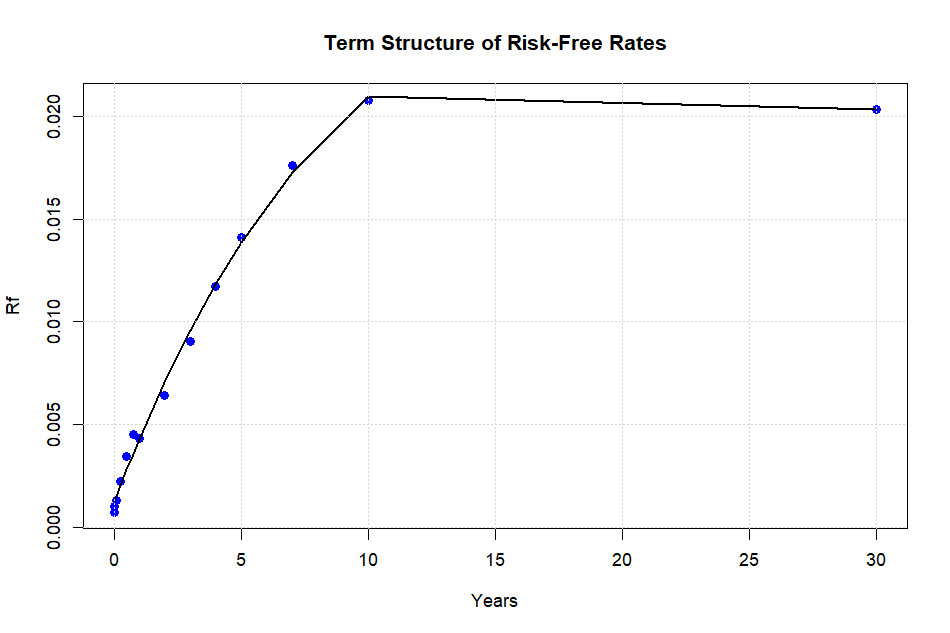
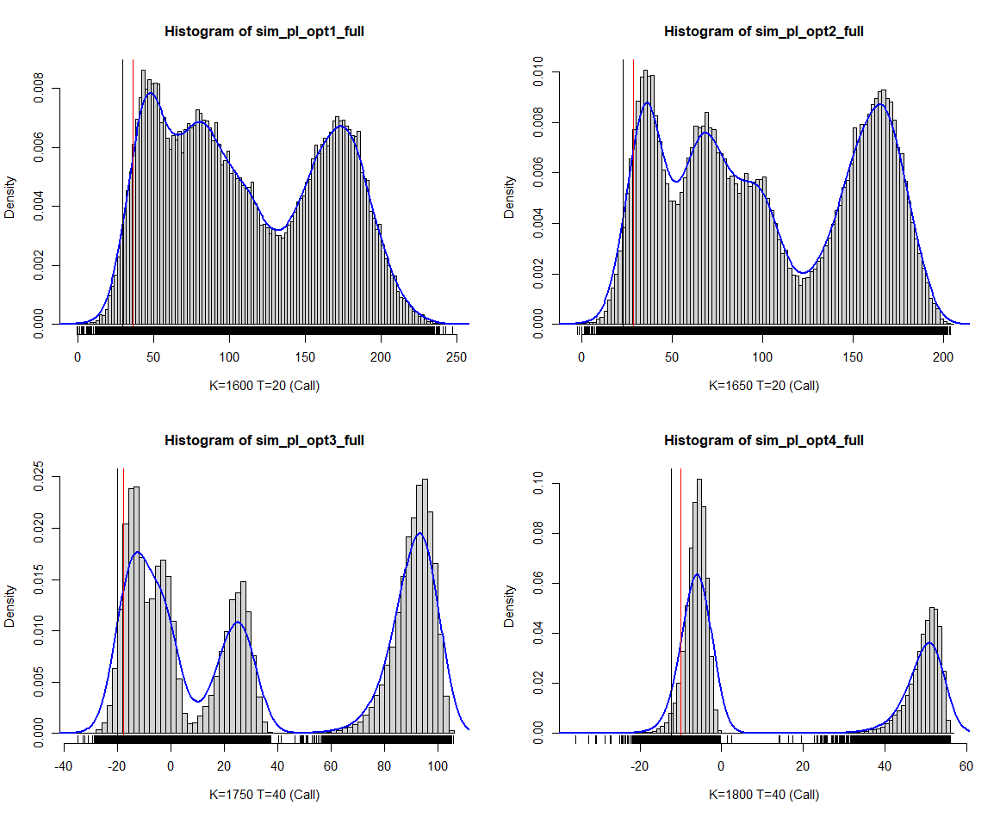
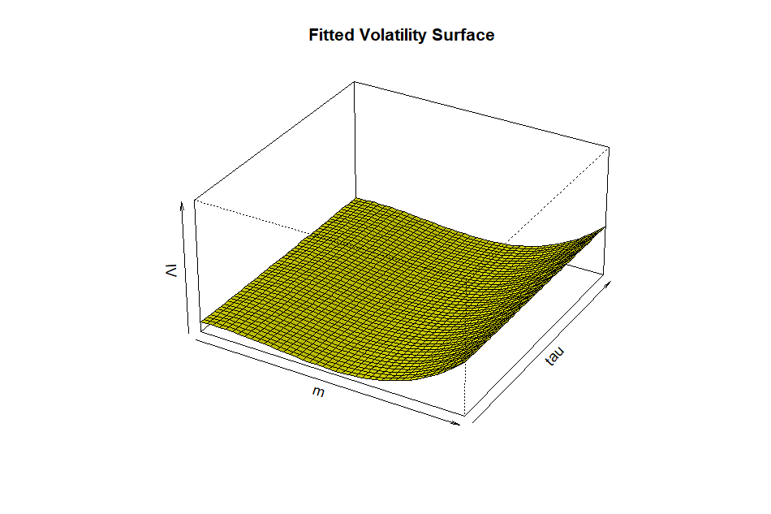

# Stats Methods for Financial Data - Project 2: Risk & Financial Management

## SP500 vs VIX

## Term structure of risk-free rates

## P/L distribution of book of options (Full Approach) 

## Volatility Surface

